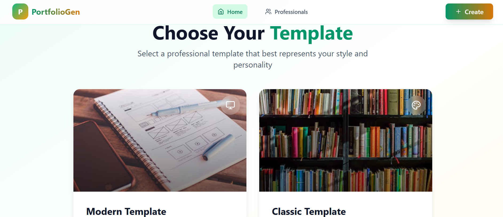
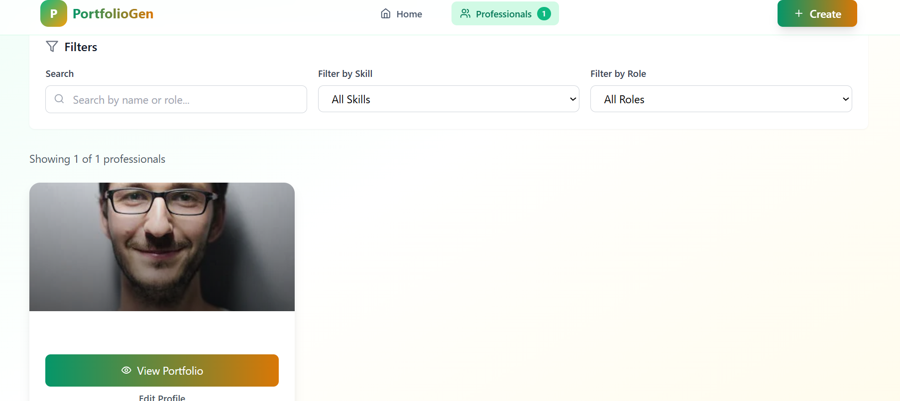
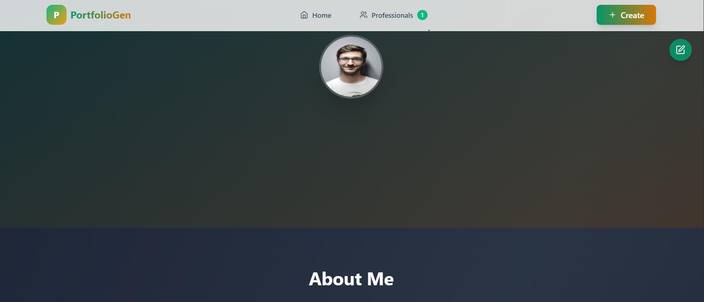

# Dynamic Portfolio Generator

A modern React application that allows users to create professional portfolios by selecting templates, filling out detailed forms, and generating beautiful portfolio websites.


## 🎥 Preview






## 🚀 Features

### Core Functionality
- **Template Selection**: Choose from 2 professionally designed templates (Modern & Classic)
- **Multi-Section Form**: Comprehensive form with 8 sections for complete portfolio creation
- **Profile Cards**: Display created portfolios as professional cards with filtering
- **Dynamic Portfolio Pages**: Full portfolio websites generated from user data
- **Edit Functionality**: Update and modify existing portfolios
- **Responsive Design**: Optimized for desktop, tablet, and mobile devices

### Template Options
1. **Modern Template**: Dark theme with glassmorphism effects and gradient accents
2. **Classic Template**: Clean, professional layout with traditional styling

### Form Sections
- **Hero Section**: Name, Title, Tagline, Profile Image
- **About Me**: Bio, Email, Phone, Location, Social Links
- **Skills**: Dynamic skill tags with add/remove functionality
- **Services**: Up to 3 services with titles and descriptions
- **Portfolio**: Up to 3 projects with images and descriptions
- **Testimonials**: Client quotes with ratings and author details
- **Blog**: Optional blog section with title and summary
- **Contact**: Contact message, email, and phone information

## 🛠️ Technology Stack

- **Frontend**: React 18 with TypeScript
- **Styling**: Tailwind CSS with custom color themes
- **Routing**: React Router DOM v7
- **State Management**: React Context API
- **Icons**: Lucide React
- **Build Tool**: Vite
- **Package Manager**: npm

## 🎨 Design System

### Color Palette
- **Primary**: Emerald Green (`#10b981`)
- **Secondary**: Amber Gold (`#f59e0b`)
- **Accent**: Pink (`#ec4899`)
- **Neutral**: Slate grays for text and backgrounds

### Key Design Features
- Gradient backgrounds and buttons
- Glassmorphism effects
- Smooth animations and transitions
- Professional typography hierarchy
- Responsive grid layouts

## 📦 Installation

1. **Clone the repository**
   ```bash
   git clone <repository-url>
   cd dynamic-portfolio-generator
   ```

2. **Install dependencies**
   ```bash
   npm install
   ```

3. **Start the development server**
   ```bash
   npm run dev
   ```

4. **Open your browser**
   Navigate to `http://localhost:5173`

## 🚀 Usage

### Creating a Portfolio

1. **Select Template**: Choose between Modern or Classic template designs
2. **Fill the Form**: Complete all 8 sections with your professional information
3. **Submit**: Create your portfolio and view it in the professionals list
4. **View Portfolio**: Click "View Portfolio" to see your generated website

### Managing Portfolios

- **Browse All**: View all created portfolios on the Professionals page
- **Filter & Search**: Use filters to find portfolios by skills or roles
- **Edit**: Click the edit button to modify existing portfolios
- **View**: Click any portfolio card to see the full portfolio website

## 📁 Project Structure

```
src/
├── components/
│   ├── templates/
│   │   ├── ModernTemplate.tsx    # Dark theme portfolio template
│   │   └── ClassicTemplate.tsx   # Clean professional template
│   ├── Header.tsx                # Navigation header component
│   ├── TemplateSelection.tsx     # Template selection page
│   ├── PortfolioForm.tsx         # Multi-step form component
│   ├── ProfessionalsList.tsx     # Portfolio cards with filtering
│   ├── PortfolioView.tsx         # Portfolio display page
│   └── EditPortfolio.tsx         # Portfolio editing interface
├── context/
│   └── PortfolioContext.tsx      # Global state management
├── types/
│   └── index.ts                  # TypeScript type definitions
├── App.tsx                       # Main application component
├── main.tsx                      # Application entry point
└── index.css                     # Global styles and Tailwind imports
```

## 🔧 Available Scripts

- `npm run dev` - Start development server
- `npm run build` - Build for production
- `npm run preview` - Preview production build
- `npm run lint` - Run ESLint

## 📱 Responsive Design

The application is fully responsive with breakpoints for:
- **Mobile**: < 768px
- **Tablet**: 768px - 1024px
- **Desktop**: > 1024px

## 💾 Data Persistence

Portfolio data is stored in the browser's localStorage, ensuring your portfolios persist between sessions.

## 🎯 Key Components

### TemplateSelection
- Displays available portfolio templates
- Handles template selection and navigation to form

### PortfolioForm
- Multi-step form with progress indicator
- Validation and data collection
- Dynamic array management for skills and testimonials

### ProfessionalsList
- Grid layout of portfolio cards
- Search and filter functionality
- Professional card design with hover effects

### Portfolio Templates
- **ModernTemplate**: Dark theme with gradients and glassmorphism
- **ClassicTemplate**: Clean, professional business-style layout

### Header
- Sticky navigation with backdrop blur
- Portfolio counter badge
- Responsive mobile menu

## 🚀 Deployment

1. **Build the project**
   ```bash
   npm run build
   ```

2. **Deploy the `dist` folder** to your preferred hosting service:
   - Netlify
   - Vercel
   - GitHub Pages
   - Any static hosting provider

## 🤝 Contributing

1. Fork the repository
2. Create a feature branch (`git checkout -b feature/amazing-feature`)
3. Commit your changes (`git commit -m 'Add amazing feature'`)
4. Push to the branch (`git push origin feature/amazing-feature`)
5. Open a Pull Request

## 📄 License

This project is licensed under the MIT License - see the LICENSE file for details.

## 🙏 Acknowledgments

- React team for the amazing framework
- Tailwind CSS for the utility-first styling approach
- Lucide React for the beautiful icons
- Pexels for the stock images used in templates

## 📞 Support

If you have any questions or need help with the project, please open an issue on GitHub.

---

**Built with ❤️ using React, TypeScript, and Tailwind CSS**